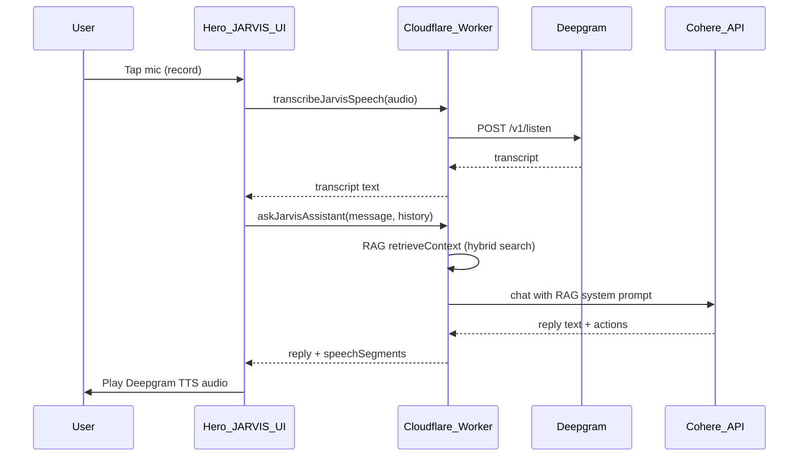
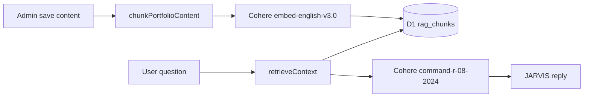

# My Intelligent Portfolio

A full-stack personal portfolio with an admin dashboard, SMTP contact form, JARVIS voice assistant (Cohere RAG), and an interactive Linux-style terminal. Built with **TanStack Start + React 19**, styled with **Tailwind v4 and shadcn/ui**, backed by **Cloudflare Workers, D1, and KV**, with **Drizzle ORM** and custom session auth — deployed via Wrangler.

This is a **full-stack SSR React app** deployed as a single Cloudflare Worker — not a separate frontend + backend.

---

## Quick Start

Choose **local Node development** for day-to-day coding, or **Docker** for a reproducible, production-like runtime.

### Prerequisites

| Method | Requirements |
|---|---|
| **Local (Node)** | [Node.js](https://nodejs.org/) 18+, [npm](https://www.npmjs.com/) |
| **Docker** | [Docker Engine](https://docs.docker.com/engine/install/) 24+ or [Docker Desktop](https://www.docker.com/products/docker-desktop/) |

---

### Option A — Run locally (Node)

```bash
# 1. Install dependencies
npm install

# 2. Set up environment variables
copy .dev.vars.example .dev.vars
# Edit .dev.vars — see Environment Variables section below

# 3. Apply local database migrations (also runs automatically before dev via predev)
npm run db:migrate:local

# 4. Start the dev server
npm run dev
```

Open **http://127.0.0.1:5173** in your browser.

---

### Option B — Run with Docker

From the **repo root**, Docker builds the app, applies local D1 migrations, and serves the Worker via Wrangler.

```bash
# 1. Create secrets file
copy .dev.vars.example .dev.vars

# 2. Edit .dev.vars — at minimum set ADMIN_EMAIL and ADMIN_PASSWORD

# 3. Build and start
npm run docker:up
```

Open **http://127.0.0.1:8787** or **http://127.0.0.1:5173** (use `http://`, not `https://`).

| Command | Purpose |
|---|---|
| `npm run docker:up` | Build and start in the background |
| `npm run docker:logs` | Stream container logs |
| `npm run docker:down` | Stop and remove containers |
| `npm run docker:restart` | Rebuild and recreate after Dockerfile changes |

> **Windows:** Ports bind to `127.0.0.1` for Docker Desktop compatibility. The container runs `wrangler dev` with local D1/KV emulation.

---

## Project Structure

```
My-Intellegent-portfolio/
├── src/
│   ├── components/          # Portfolio UI, admin dashboard, shadcn/ui
│   ├── routes/              # /, /projects, /admin, /reset-password
│   ├── lib/                 # Server logic, API functions, JARVIS, RAG, terminal
│   │   ├── api/             # createServerFn endpoints
│   │   └── terminal/        # Interactive portfolio shell (client-side)
│   ├── hooks/               # JARVIS voice, active section, portfolio query
│   └── db/                  # Drizzle schema
├── drizzle/migrations/      # D1 SQL migrations
├── public/                  # Static assets (resume PDF)
├── scripts/                 # JARVIS / Deepgram diagnostic scripts
├── docker/                  # Docker entrypoint
├── wrangler.jsonc           # Cloudflare Workers config
├── Dockerfile
├── docker-compose.yml
└── .dev.vars                # Local secrets (not committed)
```

---

## Architecture

### System overview

```
                              ┌─────────────────────────┐
                              │     Visitor / Admin     │
                              └───────────┬─────────────┘
                                          │
                              ┌───────────▼─────────────┐
                              │         Client          │
                              │  React · Router · UI    │
                              │  JARVIS · Terminal      │
                              └───────────┬─────────────┘
                                          │
                          SSR + typed server functions
                                          │
                              ┌───────────▼─────────────┐
                              │   Cloudflare Worker     │
                              │    TanStack Start       │
                              │  auth · content · API   │
                              └───────────┬─────────────┘
                    ┌─────────────────────┼─────────────────────┐
                    │                     │                     │
          ┌─────────▼─────────┐ ┌─────────▼─────────┐ ┌─────────▼─────────┐
          │    D1 SQLite      │ │    KV cache       │ │  External APIs    │
          │  portfolio · auth │ │  content · limits │ │ Deepgram · Cohere │
          │  contact · RAG    │ │  RAG status/embed │ │      SMTP         │
          └───────────────────┘ └───────────────────┘ └───────────────────┘
```

| Layer | Role |
|---|---|
| **Client** | SSR React pages, admin dashboard, JARVIS mic UI, interactive terminal |
| **Worker** | Single edge app — routing, SSR, auth, and all business logic |
| **D1** | Persistent data: portfolio content, sessions, contact messages, RAG chunks |
| **KV** | Portfolio JSON cache, JARVIS rate limits, RAG index status, query-embed cache |
| **External APIs** | Deepgram (voice), Cohere (chat + embeddings), SMTP (contact email) |

### Application layers

| Layer | Technology / Location |
|---|---|
| **Language** | TypeScript (strict, ES2022) |
| **Framework** | TanStack Start + TanStack Router + TanStack React Query |
| **Entry point** | `src/server.ts` → TanStack Start handler on Workers |
| **API layer** | `createServerFn` in `src/lib/api/*.functions.ts` |
| **Domain layer** | `src/lib/*.server.ts` (content, auth, jarvis, rag, cache) |
| **Data layer** | Drizzle ORM → D1 + KV |
| **Build** | Vite 7 + `@cloudflare/vite-plugin` + Wrangler |

### Data flow

```
Browser → TanStack Router loader / React Query
       → createServerFn (portfolio · auth · contact · jarvis)
       → *.server.ts domain modules
       → D1 (via Drizzle) + KV cache
```

Portfolio content path:

1. Read from KV cache when possible (5-min TTL)
2. Fallback to D1
3. Merged with defaults from `portfolio-defaults.ts`
4. API keys stripped before sending public content via `toPublicContent()`

---

## Routes

| URL | Description |
|---|---|
| `/` | Public portfolio — Hero (JARVIS + terminal), About, Skills, Projects, Experience, Resume, Contact |
| `/projects` | Full projects archive page with detail dialog |
| `/admin` | Admin dashboard — edit portfolio content, knowledge base, API keys |
| `/reset-password` | Password reset flow |

Default admin credentials come from `.dev.vars` on first run.

---

## Features

- **Dynamic portfolio** — Edit profile, projects, skills, experience, resume, and social links from `/admin`, stored in D1
- **Projects archive** — Dedicated `/projects` route; homepage shows featured projects with optional `hidden` flag per project
- **Contact form** — Validated server-side with Zod, emailed via **SMTP** (Gmail-compatible), archived in D1
- **JARVIS voice assistant** — Deepgram STT + TTS, portfolio-aware replies via Cohere RAG or static fallback; supports English, Hindi, and Hinglish
- **JARVIS Knowledge Base** — Admin-only free-form facts (education, hobbies, FAQs) indexed into RAG chunks
- **AI config** — Admin stores Deepgram/Cohere keys and model settings; keys never exposed publicly
- **Interactive terminal** — Linux-style portfolio shell in the Hero panel (`cd`, `ls`, `cat`, `xdg-open`, `sudo hire-me`, etc.)
- **Resume viewer** — View or download PDF from admin-uploaded or default resume URL
- **Cloudflare-native** — Single Worker handles SSR, API, and static assets

---

## Tech Stack

### Core

| Layer | Choice |
|---|---|
| **Full-stack framework** | TanStack Start |
| **UI library** | React 19 |
| **Hosting / runtime** | Cloudflare Workers (`nodejs_compat`) |
| **Build tool** | Vite 7 |
| **Database** | Cloudflare D1 (SQLite) |
| **ORM** | Drizzle ORM |
| **Cache** | Cloudflare KV (`PORTFOLIO_CACHE`) |

### Frontend

| Category | Stack |
|---|---|
| **Styling** | Tailwind CSS v4 |
| **Design system** | shadcn/ui — New York style, OKLCH colors, dark mode |
| **Icons** | Lucide React |
| **Animations** | Framer Motion |
| **Forms** | React Hook Form + Zod |
| **Toasts** | Sonner |

### Backend & Cloudflare Services

Configured in `wrangler.jsonc`:

| Service | Purpose |
|---|---|
| **Cloudflare Workers** | Runs the SSR app (`anurag-portfolio`) |
| **Cloudflare D1** | SQLite database (`portfolio-db`) |
| **Cloudflare KV** | Content cache, rate limits, RAG status, query-embed cache |
| **Wrangler** | Local dev, deploy, D1 migrations, type generation |

### Voice & AI

| Service | Purpose |
|---|---|
| **Deepgram** | Speech-to-text + text-to-speech (server-proxied) |
| **Cohere** | Chat (`command-r-08-2024`) + embeddings (`embed-english-v3.0`) for RAG |

### Contact email

| Method | Purpose |
|---|---|
| **SMTP via `cloudflare:sockets`** | Direct TLS SMTP to Gmail (or any SMTP host) — no third-party email API required |

---

## Environment Variables

Copy `.dev.vars.example` to `.dev.vars`:

| Variable | Required | Purpose |
|---|---|---|
| `ADMIN_EMAIL` | Yes | Admin login email |
| `ADMIN_PASSWORD` | Yes | Admin login password |
| `SMTP_PASS` | For contact form | Gmail App Password (or SMTP password) — **never stored in D1** |
| `SMTP_USER` | Recommended | SMTP username; defaults to profile email if omitted |
| `SMTP_HOST` | Optional | Default `smtp.gmail.com` |
| `SMTP_PORT` | Optional | Default `465` |
| `DEEPGRAM_API_KEY` | For voice | JARVIS STT + TTS |
| `COHERE_API_KEY` | Optional | AI replies + RAG embeddings (or set in admin UI) |


**Production (Cloudflare):**

```bash
wrangler secret put ADMIN_EMAIL
wrangler secret put ADMIN_PASSWORD
wrangler secret put SMTP_PASS
wrangler secret put SMTP_USER        # optional
wrangler secret put DEEPGRAM_API_KEY
wrangler secret put COHERE_API_KEY   # optional
```

**Contact form:** Submissions are emailed to the address in **Admin → Profile & Contact** and stored in D1 `contact_messages`. Set `SMTP_PASS` as a Wrangler secret — it is not editable from the admin panel for security.

**Admin UI (API Configuration panel)** — stored in D1, never in public content:

- `cohereApiKey`, `deepgramApiKey`, `primaryModel` (`cohere` | `static`)
- `jarvisEnabled` (kill switch)
- `deepgramSttModel`, `deepgramTtsModel` (optional tuning)

**Recommendation:** Keep API keys in Wrangler secrets; admin UI keys act as overrides when saved.

---

## Available Scripts

| Command | Description |
|---|---|
| `npm run dev` | Start local dev server (runs `predev` → applies D1 migrations first) |
| `npm run build` | Production build |
| `npm run deploy` | Build + deploy to Cloudflare |
| `npm run db:migrate:local` | Apply D1 migrations locally |
| `npm run db:migrate:remote` | Apply D1 migrations in production |
| `npm run lint` | Run ESLint |
| `npm run format` | Format with Prettier |
| `npm run docker:up` | Docker Compose build + start |
| `node scripts/test-jarvis-pipeline.mjs` | Diagnose JARVIS API keys and Cohere/Deepgram connectivity |

---

## Auth & Security

Custom auth (no NextAuth/Clerk):

- **Password hashing:** Web Crypto PBKDF2 (100k iterations, SHA-256)
- **Sessions:** DB-backed sessions + HTTP-only cookie (`portfolio_session`, 7-day expiry)
- **Secrets:** From `.dev.vars` (local) or `wrangler secret put` (production)
- **Public vs admin data:** API keys and knowledge base stripped from public responses via `toPublicContent()`
- **Rate limiting:** JARVIS and contact endpoints rate-limited per IP via KV

---

## Database

D1 tables (defined in `src/db/schema.ts`):

| Table | Purpose |
|---|---|
| `portfolio_content` | Editable portfolio JSON |
| `admin_users` | Admin accounts |
| `sessions` | Login sessions |
| `contact_messages` | Contact form submissions |
| `rag_chunks` | RAG embedding chunks (Cohere vectors + portfolio text) |

Migrations live in `drizzle/migrations/`:

| Migration | Adds |
|---|---|
| `0000_init.sql` | Core tables |
| `0001_add_phone_to_contact.sql` | Phone field on contact messages |
| `0002_rag_chunks.sql` | RAG chunks table |

Apply with `npm run db:migrate:local` (dev) or `npm run db:migrate:remote` (production).

---

## JARVIS Voice Assistant

JARVIS lets visitors ask questions about the portfolio using their microphone. Deepgram handles speech ↔ text; Cohere (with RAG) or a static fallback generates portfolio-aware replies. API keys are proxied through Cloudflare Workers — never exposed to the browser.

### Voice request flow



**Optimized path:** `processJarvisVoice` combines STT + reply + TTS segments in one server round-trip for lower latency.

### Server functions

| Function | Purpose |
|---|---|
| `getJarvisConfig` | Public status (enabled, Deepgram configured) |
| `getDeepgramToken` | Short-lived Deepgram grant (if needed) |
| `transcribeJarvisSpeech` | Audio → transcript |
| `processJarvisVoice` | Audio → transcript + reply + TTS segments (single call) |
| `askJarvisAssistant` | Text → reply (+ optional TTS segments) |
| `synthesizeJarvisSpeech` | Text → MP3 audio |
| `getRagIndexStatus` | Admin: current RAG index state |
| `reindexRag` | Admin: force background re-index |

**Rate limiting** (Cloudflare KV, per IP per hour):

| Bucket | Limit |
|---|---|
| `ask` | 30 |
| `tts` | 60 |
| `token` | 120 |
| `contact` | 8 |

### Client

Hook: `src/hooks/use-jarvis-voice.ts`

- States: `ready` → `listening` → `processing` → `responding`
- Suggestion chips for text-only queries
- Language detection: English, Hindi, Hinglish
- Structured actions: scroll to section, open resume

### Server implementation

| File | Responsibility |
|---|---|
| `src/lib/api/jarvis.functions.ts` | Public server function endpoints |
| `src/lib/jarvis.server.ts` | Voice turn orchestration, rate limits, TTS |
| `src/lib/deepgram.server.ts` | Deepgram STT/TTS fetch wrappers |
| `src/lib/llm.server.ts` | Cohere adapter, RAG/full-context prompt builder |
| `src/lib/rag.server.ts` | Chunking, embedding, D1 storage, hybrid retrieval |
| `src/lib/jarvis-intent.ts` | Query focus detection (projects, skills, contact, etc.) |
| `src/lib/jarvis-answer.server.ts` | Static fallback answers |
| `src/lib/jarvis-kb.server.ts` | Knowledge base helpers |
| `src/lib/jarvis-actions.ts` | Scroll / resume action mapping |

---

## RAG Pipeline (Cohere)

RAG indexes portfolio content + admin Knowledge Base into D1 on every admin save. At query time, hybrid retrieval combines semantic search, intent focus, and keyword matching.

### Architecture



### Indexed sources

| Source | Content |
|---|---|
| `profile` | Name, role, headline, location, socials |
| `about` | About text |
| `project` | Each visible project (title, description, stack, links) |
| `skills` | Skill categories and items |
| `experience` | Work history entries |
| `knowledge_base` | Admin free-form facts (JARVIS Knowledge Base tab) |

### Indexing workflow

1. **On admin save** — `saveAdminContent()` triggers background indexing via `waitUntil(indexContent(...))`
2. **Content fingerprint** — Skips re-embedding if portfolio JSON unchanged (unless forced)
3. **Chunk → embed → persist** — Cohere batches embeddings; D1 writes in batches of 50
4. **Status tracking** — KV stores `idle` / `indexing` / `ready` / `failed` / `unconfigured` with progress (`phase`, `processedChunks`, `totalChunks`)
5. **Manual re-index** — Admin → API Configuration → **Re-index RAG** (polls `getRagIndexStatus`)

### Query-time retrieval

| Strategy | When used |
|---|---|
| **Focus fast-path** | Structured questions (projects, skills, experience) — skips query embed (~300–800 ms saved) |
| **Keyword fast-path** | Strong knowledge-base keyword match — skips embed |
| **Hybrid search** | Default — semantic top-5 + keyword top-4 + focus boosting, max 10 context chunks |
| **Query embed cache** | KV cache (1 h TTL) avoids re-embedding repeat questions |
| **In-memory chunk cache** | 5-min TTL avoids D1 reads on every question |

### RAG improvements summary

| Feature | Detail |
|---|---|
| Hybrid retrieval | Semantic + focus-based chunk boosting by intent |
| Query embed cache | KV, 1 h TTL |
| Batch D1 writes | Drizzle batch inserts (50 per batch) |
| Fingerprint skip | Re-index skipped when content unchanged |
| Index status UI | Live badge, auto-poll while indexing, manual re-index button |
| Background indexing | Non-blocking via `waitUntil` on admin save |

### Admin RAG status states

| State | Meaning |
|---|---|
| `unconfigured` | No Cohere API key |
| `idle` | Not yet indexed |
| `indexing` | Embedding in progress (poll every 1 s) |
| `ready` | Chunks indexed and searchable |
| `failed` | Indexing error (see `error` field) |

---

## Interactive Terminal

The Hero panel includes a toggle between **J.A.R.V.I.S** and **Linux Terminal**. The terminal is a client-side virtual filesystem wired to live portfolio data:

| Command | Action |
|---|---|
| `ls`, `cd`, `cat`, `pwd` | Navigate virtual portfolio directories |
| `whoami` | Profile summary |
| `xdg-open <section>` | Scroll to site section or open resume |
| `sudo hire-me` | Recruiter easter egg with contact info |
| `help`, `clear`, `history` | Standard shell helpers |

Implementation: `src/lib/terminal/` + `src/components/portfolio/PortfolioTerminal.tsx`

---

## Admin Dashboard

| Tab | Purpose |
|---|---|
| Profile & Contact | Name, email, role, headline, intro, photo |
| About | About section text |
| Projects | Add/edit/hide projects |
| Skills | Skill categories |
| Experience | Work history |
| Resume | Upload or link resume PDF |
| Social Links | GitHub, LinkedIn, etc. |
| JARVIS Knowledge Base | Free-form facts for RAG (max 24 000 chars) |
| API Configuration | Deepgram/Cohere keys, model settings, RAG status + re-index |

---

## Deployment

```bash
# One-time: set production secrets
wrangler secret put ADMIN_EMAIL
wrangler secret put ADMIN_PASSWORD
wrangler secret put SMTP_PASS
wrangler secret put DEEPGRAM_API_KEY
wrangler secret put COHERE_API_KEY    # optional

# Apply remote migrations (before first deploy)
npm run db:migrate:remote

# Build and deploy
npm run deploy
```

The Worker is named **`anurag-portfolio`** with observability enabled (see `wrangler.jsonc`).

After deploy, log into `/admin`, save content once to trigger the initial RAG index, and verify the RAG status badge shows **Ready**.

---

## Docker Deployment

Multi-stage Dockerfile + Compose for local, production-like testing with **Wrangler dev**, local **D1**, and **KV** (persists RAG chunks and cache across restarts).

### Strategy

| Piece | Detail |
|---|---|
| **Build stage** | Node 22 Alpine — `npm ci` + `npm run build` |
| **Runtime stage** | Node 22 Debian slim (glibc for workerd) |
| **Secrets** | Repo-root `.dev.vars` mounted read-only into the container |
| **Persistence** | Named volume `portfolio_wrangler_state` → `/app/.wrangler/state` (D1 + KV) |
| **Entrypoint** | Applies D1 migrations, symlinks state into `dist/server`, starts `wrangler dev` on port **8787** |
| **Health check** | `GET http://127.0.0.1:8787/` |

### Setup

```bash
copy .dev.vars.example .dev.vars
# Set ADMIN_EMAIL, ADMIN_PASSWORD (required)
# Optional: SMTP_*, DEEPGRAM_API_KEY, COHERE_API_KEY
```

### Commands

```bash
# Compose (recommended)
npm run docker:up
npm run docker:logs
npm run docker:down
npm run docker:restart   # after Dockerfile or dependency changes

# Manual build + run
docker build -t anurag-portfolio:local .
docker run --rm \
  -p 127.0.0.1:8787:8787 \
  -v "%cd%\.dev.vars:/app/.dev.vars:ro" \
  -v portfolio_wrangler_state:/app/.wrangler/state \
  --env-file .dev.vars \
  anurag-portfolio:local
```

Open **http://127.0.0.1:8787** or **http://127.0.0.1:5173** (both map to the same app).

| Variable | Required in Docker | Purpose |
|---|---|---|
| `ADMIN_EMAIL` | Yes | Admin login |
| `ADMIN_PASSWORD` | Yes | Admin login |
| `SMTP_PASS` | For contact form | Gmail App Password (Wrangler secret in prod) |
| `SMTP_USER` | Recommended | SMTP username |
| `DEEPGRAM_API_KEY` | For JARVIS voice | STT + TTS |
| `COHERE_API_KEY` | For RAG / AI replies | Embeddings + chat |

> **Note:** Docker runs `wrangler dev` for local container testing. Production edge deployment uses `npm run deploy`.

---

## Development Notes

- **Path alias:** `@/*` maps to `src/*`
- **Auto migrations:** `predev` script applies local D1 migrations before `vite dev`
- **JARVIS diagnostics:** `node scripts/test-jarvis-pipeline.mjs` validates API keys and connectivity
- **Hydration-safe terminal:** Dynamic "Last login" timestamp renders client-side only (avoids SSR mismatch)
- **Public content safety:** `toPublicContent()` strips `cohereApiKey`, `deepgramApiKey`, and `jarvisKnowledgeBase`
