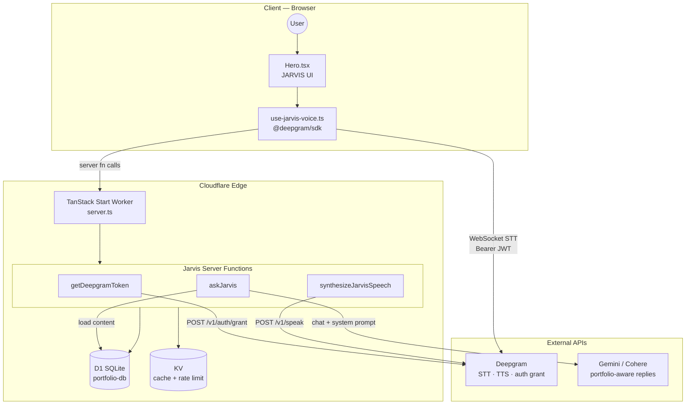
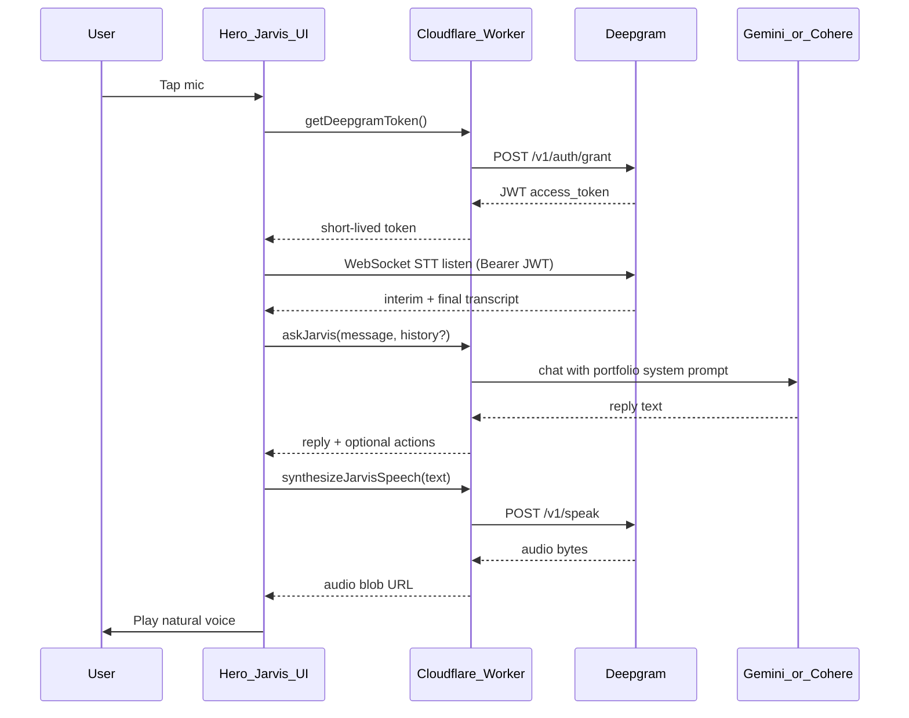

# My Intelligent Portfolio

A full-stack personal portfolio with an admin dashboard, contact form, and JARVIS voice assistant. Built with **TanStack Start + React 19**, styled with **Tailwind v4 and shadcn/ui**, backed by **Cloudflare Workers, D1, and KV**, with **Drizzle ORM** and custom session auth — deployed via Wrangler.

This is a **full-stack SSR React app** deployed as a single Cloudflare Worker — not a separate frontend + backend.

---

## Quick Start

Choose **local Node development** for day-to-day coding, or **Docker** for a reproducible, production-like runtime without installing Node on the host.

### Prerequisites

| Method | Requirements |
|---|---|
| **Local (Node)** | [Node.js](https://nodejs.org/) 18+, [npm](https://www.npmjs.com/) |
| **Docker** | [Docker Engine](https://docs.docker.com/engine/install/) 24+ or [Docker Desktop](https://www.docker.com/products/docker-desktop/), with Docker Compose v2 |

---

### Option A — Run locally (Node)

```bash
# 1. Go to the app folder
cd Anurag313y

# 2. Install dependencies
npm install

# 3. Set up environment variables
copy .dev.vars.example .dev.vars
# Edit .dev.vars — see Environment Variables section below

# 4. Apply local database migrations
npm run db:migrate:local

# 5. Start the dev server
npm run dev
```

Open **http://127.0.0.1:5173** in your browser.

> **Tip:** You can also run `npm run dev` from the repo root — it forwards to `Anurag313y/` automatically.

---

### Option B — Run with Docker

From the **repo root**, Docker builds the app, applies local D1 migrations, and serves the Worker via Wrangler on port **8787**.

```bash
# 1. Create environment file
cp docker/.env.example docker/.env
# Windows: copy docker\.env.example docker\.env

# 2. Edit docker/.env — at minimum set ADMIN_EMAIL and ADMIN_PASSWORD
#    Optional: RESEND_*, DEEPGRAM_API_KEY, GEMINI_API_KEY, COHERE_API_KEY

# 3. Build and start (foreground)
docker compose up --build

# Or run detached in the background
docker compose up --build -d
```

Open **http://127.0.0.1:8787** in your browser.

| Command | Purpose |
|---|---|
| `docker compose logs -f` | Stream container logs |
| `docker compose ps` | Check service and health status |
| `docker compose down` | Stop and remove containers |
| `docker compose up --build --force-recreate` | Rebuild after dependency or Dockerfile changes |

> **Note:** The container uses a multi-stage build and runs `wrangler dev` with local D1/KV emulation — ideal for demos, CI, and smoke testing. For image architecture, platform deployment, and raw `docker build` / `docker run` commands, see [Docker Deployment](#docker-deployment).

---

## Project Structure

```
My-Intellegent-portfolio/
├── Anurag313y/              # Main application (all code lives here)
│   ├── src/
│   │   ├── components/      # UI components (portfolio, admin, shadcn/ui)
│   │   ├── routes/          # Pages: /, /admin, /reset-password
│   │   ├── lib/             # Server logic, API functions, JARVIS
│   │   └── hooks/           # React hooks (voice assistant, etc.)
│   ├── drizzle/             # Database migrations
│   ├── public/              # Static assets (resume PDF)
│   ├── wrangler.jsonc       # Cloudflare Workers config
│   └── .dev.vars            # Local secrets (not committed)
├── package.json             # Root scripts (forwards to Anurag313y)
└── README.md
```

All application code is inside **`Anurag313y/`**. The repo root only contains wrapper scripts and documentation.

---

## Architecture

### System overview

```
                              ┌─────────────────────────┐
                              │     Visitor / Admin     │
                              └───────────┬─────────────┘
                                          │
                              ┌───────────▼─────────────┐
                              │         Client          │
                              │  React · Router · UI    │
                              │  JARVIS voice interface │
                              └───────────┬─────────────┘
                                          │
                          SSR + typed server functions
                                          │
                              ┌───────────▼─────────────┐
                              │   Cloudflare Worker     │
                              │    TanStack Start       │
                              │  auth · content · API   │
                              └───────────┬─────────────┘
                    ┌─────────────────────┼─────────────────────┐
                    │                     │                     │
          ┌─────────▼─────────┐ ┌─────────▼─────────┐ ┌─────────▼─────────┐
          │    D1 SQLite      │ │    KV cache       │ │  External APIs    │
          │  portfolio · auth │ │  content · limits │ │ Deepgram · Gemini │
          │  contact messages │ │                   │ │      Cohere       │
          └───────────────────┘ └───────────────────┘ └───────────────────┘
```

| Layer | Role |
|---|---|
| **Client** | SSR React pages, admin dashboard, JARVIS mic UI |
| **Worker** | Single edge app — routing, SSR, auth, and all business logic |
| **D1** | Persistent data: portfolio content, sessions, contact messages |
| **KV** | Fast cache for portfolio JSON and JARVIS rate limits |
| **External APIs** | Speech and conversational AI — keys never sent to the browser |

### Application layers

| Layer | Technology / Location |
|---|---|
| **Language** | TypeScript (strict, ES2022) |
| **Framework** | TanStack Start + TanStack Router + TanStack React Query |
| **Entry point** | `src/server.ts` → TanStack Start handler on Workers |
| **API layer** | `createServerFn` in `src/lib/api/*.functions.ts` |
| **Domain layer** | `src/lib/*.server.ts` (content, auth, jarvis, cache) |
| **Data layer** | Drizzle ORM → D1 + KV |
| **Build** | Vite 7 + `@cloudflare/vite-plugin` + Wrangler |

### Data flow

```
Browser → TanStack Router loader / React Query
       → createServerFn (portfolio · auth · contact · jarvis)
       → content.server.ts / jarvis.server.ts
       → D1 (via Drizzle) + KV cache
```

Portfolio content path:

1. Read from KV cache when possible (5-min TTL)
2. Fallback to D1
3. Merged with defaults from `portfolio-defaults.ts`
4. API keys (Gemini/Cohere) stripped before sending public content

---

## Routes

| URL | Description |
|---|---|
| `/` | Public portfolio (Hero, About, Projects, Skills, Contact) |
| `/admin` | Admin dashboard — edit portfolio content |
| `/reset-password` | Password reset flow |

Default admin credentials come from your `.dev.vars` file on first run.

TanStack Router uses file-based routes. Portfolio content is loaded in route loaders and cached via React Query (5-minute stale time).

---

## Features

- **Dynamic portfolio** — Edit profile, projects, skills, and experience from `/admin`, stored in D1
- **Contact form** — Validated server-side with Zod, emailed to your Admin → Profile email via Resend, archived in D1
- **JARVIS voice assistant** — Deepgram STT + TTS, portfolio-aware replies via Gemini/Cohere or static fallback
- **AI config** — Admin can store Gemini/Cohere API keys and choose a primary model; keys are admin-only
- **Interactive terminal** — Client-side command simulation on the homepage (static, not AI-powered)
- **Resume download** — PDF served from `public/resume.pdf`
- **Cloudflare-native** — Single Worker handles SSR, API, and static assets

---

## Tech Stack

### Core

| Layer | Choice |
|---|---|
| **Full-stack framework** | TanStack Start |
| **UI library** | React 19 |
| **Hosting / runtime** | Cloudflare Workers (`nodejs_compat`) |
| **Build tool** | Vite 7 |
| **Database** | Cloudflare D1 (SQLite) |
| **ORM** | Drizzle ORM |
| **Cache** | Cloudflare KV (`PORTFOLIO_CACHE`) |

### Frontend (UI)

| Category | Stack |
|---|---|
| **Styling** | Tailwind CSS v4 (`@tailwindcss/vite`) |
| **Design system** | shadcn/ui — New York style, Slate base, CSS variables |
| **Primitives** | Radix UI (dialog, tabs, select, accordion, etc.) |
| **Icons** | Lucide React |
| **Animations** | Framer Motion (Hero, NavBar, sections) |
| **Forms** | React Hook Form + Zod validators |
| **Toasts** | Sonner |
| **Charts** | Recharts (via shadcn `chart` component) |
| **Utilities** | `clsx`, `tailwind-merge`, `class-variance-authority` |

Tailwind v4 uses a custom theme in `styles.css` with **OKLCH colors** and dark mode via a `.dark` class.

Other UI: **cmdk**, **vaul**, **embla-carousel**, **react-day-picker**, **input-otp**.

### Backend & Cloudflare Services

Configured in `wrangler.jsonc`:

| Service | Purpose |
|---|---|
| **Cloudflare Workers** | Runs the SSR app |
| **Cloudflare D1** | SQLite database (`portfolio-db`) |
| **Cloudflare KV** | Portfolio content cache + JARVIS rate limits |
| **Wrangler** | Local dev, deploy, D1 migrations, type generation |

### Voice & Chat AI

| Service | Purpose |
|---|---|
| **Deepgram** | Speech-to-text (live WebSocket) + text-to-speech |
| **Google Gemini** | Portfolio-aware conversational replies |
| **Cohere** | Alternative LLM (configurable in admin) |

### Developer Tooling

| Tool | Role |
|---|---|
| **Vite 7** | Dev server (port 5173), build |
| **@cloudflare/vite-plugin** | Workers SSR integration |
| **ESLint 9** | Linting (React Hooks, Prettier integration) |
| **Prettier** | Formatting |
| **drizzle-kit** | Schema migrations against D1 |
| **TypeScript 5.8** | Strict type checking |

### Validation & Types

- **Zod** validates server function inputs (admin login, contact form, content updates)
- Shared types in `content.types.ts`
- Path alias `@/*` → `src/*`

---

## Environment Variables

Copy `Anurag313y/.dev.vars.example` to `Anurag313y/.dev.vars`:

| Variable | Required | Purpose |
|---|---|---|
| `ADMIN_EMAIL` | Yes | Admin login email |
| `ADMIN_PASSWORD` | Yes | Admin login password |
| `RESEND_API_KEY` | For contact form | Sends contact messages to **Admin → Profile & Contact** email |
| `RESEND_FROM` | Recommended | Verified sender, e.g. `Portfolio <hello@yourdomain.com>` |
| `DEEPGRAM_API_KEY` | For voice | JARVIS STT + TTS + auth grant |
| `GEMINI_API_KEY` | Optional | AI replies (or set in admin UI) |
| `COHERE_API_KEY` | Optional | AI replies (or set in admin UI) |

Never commit `.dev.vars` to Git — it is already in `.gitignore`.

**Production (Cloudflare):**

```bash
cd Anurag313y
wrangler secret put ADMIN_EMAIL
wrangler secret put ADMIN_PASSWORD
wrangler secret put RESEND_API_KEY
wrangler secret put RESEND_FROM       # optional but required for custom domains
wrangler secret put DEEPGRAM_API_KEY
wrangler secret put GEMINI_API_KEY    # optional
wrangler secret put COHERE_API_KEY    # optional
```

**Contact form:** Create a [Resend](https://resend.com) API key, verify your sending domain, and set `RESEND_FROM`. Submissions are emailed to the address in **Admin → Profile & Contact** (not `ADMIN_EMAIL`) and also stored in D1 `contact_messages`.

**Admin UI (API panel)** — stored in D1, never in public content:

- `geminiApiKey`, `cohereApiKey`, `primaryModel` (`gemini` | `cohere` | `static`)
- `jarvisEnabled` (kill switch)
- `deepgramSttModel`, `deepgramTtsModel` (optional tuning)

**Recommendation:** Keep `DEEPGRAM_API_KEY` in Wrangler secrets only, not in portfolio JSON.

---

## Available Scripts

Run from **`Anurag313y/`** (or use root shortcuts):

| Command | Description |
|---|---|
| `npm run dev` | Start local dev server |
| `npm run build` | Production build |
| `npm run deploy` | Build + deploy to Cloudflare |
| `npm run db:migrate:local` | Apply D1 migrations locally |
| `npm run db:migrate:remote` | Apply D1 migrations in production |
| `npm run lint` | Run ESLint |
| `npm run format` | Format code with Prettier |

**From repo root:** `npm run dev`, `npm run build`, `npm run db:migrate:local` — all forward to `Anurag313y/`.

---

## Auth & Security

Custom auth (no NextAuth/Clerk):

- **Password hashing:** Web Crypto PBKDF2 (100k iterations, SHA-256)
- **Sessions:** DB-backed sessions + HTTP-only cookie (`portfolio_session`, 7-day expiry)
- **Secrets:** From `.dev.vars` (local) or `wrangler secret put` (production)
- **Public vs admin data:** API keys stripped from public portfolio responses via `toPublicContent()`

---

## Database

D1 tables (defined in `Anurag313y/src/db/schema.ts`):

| Table | Purpose |
|---|---|
| `portfolio_content` | Editable portfolio JSON |
| `admin_users` | Admin accounts |
| `sessions` | Login sessions |
| `contact_messages` | Contact form submissions |

Migrations live in `Anurag313y/drizzle/migrations/` and are applied with `wrangler d1 migrations apply`.

---

## JARVIS Voice Assistant

JARVIS lets visitors ask questions about the portfolio using their microphone. Deepgram handles speech ↔ text; Gemini/Cohere (or static fallback) generates portfolio-aware replies. API keys are proxied through Cloudflare Workers — never exposed to the browser.

**How it works:**

1. User speaks → Deepgram converts speech to text (browser WebSocket + short-lived JWT)
2. Text sent to server → Gemini/Cohere generates a portfolio-aware reply
3. Reply converted to speech → Deepgram TTS plays natural voice audio

### JARVIS architecture



| Layer | Components | Role |
|---|---|---|
| **Client** | `Hero.tsx`, `use-jarvis-voice.ts` | Mic capture, live transcript UI, audio playback |
| **Worker** | `jarvis.functions.ts`, `jarvis.server.ts`, `deepgram.server.ts`, `llm.server.ts` | Proxy secrets, LLM routing, rate limits |
| **Cloudflare data** | D1, KV | Portfolio content, sessions, cache, per-IP limits |
| **External** | Deepgram, Gemini/Cohere | Speech ↔ text, natural language answers |

### Voice request flow



**Why two paths to Deepgram?**

| Concern | Approach |
|---|---|
| **STT latency** | Live WebSocket from the **browser** using a **temporary JWT** from your Worker — never ship the main API key to the client |
| **TTS** | **Server-proxied** `POST /v1/speak` keeps billing and control on the Worker |

### Hero UI states

`Anurag313y/src/components/portfolio/Hero.tsx`:

- States: `ready` → `listening` → `processing` → `responding`
- **STT:** Deepgram live WebSocket via `@deepgram/sdk` + short-lived JWT from Worker
- **TTS:** Server-proxied Deepgram Aura voice (`synthesizeJarvisSpeech`)
- **Brain:** Server-side `askJarvis` → Gemini / Cohere / static fallback
- Suggestion chips call text-only `handleQuery(text)`

### APIs & keys

#### Deepgram (required for voice)

| Purpose | Endpoint | Auth |
|---|---|---|
| Grant temp token (browser STT) | `POST https://api.deepgram.com/v1/auth/grant` | `Authorization: Token <DEEPGRAM_API_KEY>` |
| Live STT (browser) | `wss://api.deepgram.com/v1/listen?model=nova-3&...` | `Authorization: Bearer <JWT>` |
| TTS (server) | `POST https://api.deepgram.com/v1/speak?model=aura-2-thalia-en&encoding=mp3` | `Authorization: Token <DEEPGRAM_API_KEY>` |

Get a key from [Deepgram Console](https://console.deepgram.com/). Suggested models: STT `nova-3`, TTS `aura-2-thalia-en`.

#### Conversational brain (recommended)

| Provider | When to use |
|---|---|
| **Google Gemini** | Admin `primaryModel: gemini` — [Google AI Studio](https://aistudio.google.com/apikey) |
| **Cohere** | Admin `primaryModel: cohere` |
| **Static fallback** | `primaryModel: static` or missing keys |

#### Browser (no keys)

- `getUserMedia({ audio: true })` — mic permission
- `HTMLAudioElement` — play Deepgram MP3 response

### Server implementation

| File | Responsibility |
|---|---|
| `src/lib/api/jarvis.functions.ts` | `createServerFn` endpoints |
| `src/lib/jarvis.server.ts` | Deepgram token grant, TTS proxy, LLM routing |
| `src/lib/deepgram.server.ts` | Fetch wrappers for grant + speak |
| `src/lib/llm.server.ts` | Gemini + Cohere adapters + system prompt builder |
| `src/lib/jarvis-answer.server.ts` | Static fallback answers |
| `src/lib/jarvis-actions.ts` | Structured scroll / resume actions |

**Server functions (public, rate-limited):**

1. **`getDeepgramToken`** — `POST /v1/auth/grant` → `{ accessToken, expiresIn }`
2. **`askJarvis`** — `{ message, history? }` → loads portfolio context, calls LLM, returns `{ text, actions? }`
3. **`synthesizeJarvisSpeech`** — `{ text }` → returns `audio/mpeg` bytes

**Rate limiting** (Cloudflare KV): max **30** `askJarvis` + **60** TTS requests per IP per hour → `429` when exceeded.

### Client implementation

Hook: `Anurag313y/src/hooks/use-jarvis-voice.ts`

| Step | Behavior |
|---|---|
| Start listen | Request mic → `getDeepgramToken()` → open Deepgram live connection |
| Stop / finalize | Close WS, send transcript to `askJarvis` |
| Respond | Play audio from `synthesizeJarvisSpeech` via `URL.createObjectURL` |
| Actions | Map `scrollTo` ids to `scrollIntoView` / `window.open` for resume |
| Errors | Toast + revert to `ready`; re-fetch token if expired |

### System prompt (JARVIS personality)

Short answers for voice (1–3 sentences), first-person as assistant, only portfolio data from context, refuse unrelated requests politely.

### JARVIS setup checklist

1. Add `DEEPGRAM_API_KEY` to `.dev.vars`
2. Run `npm run dev`
3. Chrome/Edge: grant mic → speak → hear Aura voice reply
4. Admin: set `primaryModel` to `gemini`, save key, ask open-ended question
5. Verify public `getPortfolioContent` has **no** API keys
6. Production: `wrangler secret put DEEPGRAM_API_KEY` then smoke test

| Service | What you get | Used for |
|---|---|---|
| **Deepgram** | API key | STT, TTS, temp tokens |
| **Gemini** or **Cohere** | API key | Natural language answers |
| **Browser** | Mic permission | Audio capture |

### Implementation status

| Phase | Deliverable | Status |
|---|---|---|
| **1** | Worker secrets + `getDeepgramToken` + live STT in Hero | Done |
| **2** | `synthesizeJarvisSpeech` + replace `speechSynthesis` | Done |
| **3** | `askJarvis` + Gemini/Cohere + structured scroll actions | Done |
| **4** | KV rate limits + admin kill switch + error/fallback UX | Done |

---

## Deployment

```bash
cd Anurag313y

# One-time: set production secrets
wrangler secret put ADMIN_EMAIL
wrangler secret put ADMIN_PASSWORD
wrangler secret put RESEND_API_KEY
wrangler secret put DEEPGRAM_API_KEY

# Apply remote migrations (before first deploy)
npm run db:migrate:remote

# Build and deploy
npm run deploy
```

The Worker is named **`anurag-portfolio`** with observability enabled (see `wrangler.jsonc`).

## Docker Deployment

This project is a **single Cloudflare Worker SSR app** (TanStack Start). The containerization uses an **optimized multi-stage Dockerfile** and runs the Worker using **`wrangler dev`** with an explicit port so the service is reachable from the container and can be health-checked.

### Architecture & strategy
- **Multi-stage build** for smaller images and better caching:
  - `deps` stage: deterministic `npm ci` from `package-lock.json`
  - `build` stage: compiles the Worker bundle (`npm run build`)
  - `runtime` stage: lightweight **Alpine-based** Node image
- **Production-like runtime**: container starts **Wrangler dev** (`wrangler dev`) and binds to `0.0.0.0` so Docker can expose it.
- **Non-root user**: the runtime image runs as a non-root `app` user.
- **Health check**: Docker probes `GET http://127.0.0.1:$PORT/` and requires an HTTP 2xx/3xx response.

### Environment variables (.env files)
Docker Compose loads variables from `docker/.env`.

1. Create your env file:
```bash
cp docker/.env.example docker/.env
```

2. Fill in values:
- `ADMIN_EMAIL`, `ADMIN_PASSWORD`
- `RESEND_API_KEY`, `RESEND_FROM`
- `DEEPGRAM_API_KEY`
- Optional: `GEMINI_API_KEY`, `COHERE_API_KEY`

> Secrets are kept in local env files and not committed.

### Local build + run (Docker)
From the repo root:

#### Build
```bash
docker build -t anurag-portfolio:local .
```

#### Run
```bash
docker run --rm -p 8787:8787 --env-file ./docker/.env anurag-portfolio:local
```

#### Stop
```bash
docker ps
docker stop <container_id>
```

#### Rebuild
```bash
docker build --no-cache -t anurag-portfolio:local .
```

#### View logs
```bash
docker logs -f <container_id>
```

### Docker Compose
```bash
# Build + start
docker compose up --build

# Stop
docker compose down

# Rebuild
docker compose up --build --force-recreate

# Logs
docker compose logs -f
```

### Deploy on Docker-compatible platforms (Render / AWS / DO / DigitalOcean)
This image runs `wrangler dev` for local container testing (HTTP-exposed on **8787**). For Docker-compatible production deployments, push the image to your registry and set environment variables via the platform UI using the same keys as `docker/.env`.

Suggested container port:
- `8787`

1. Push image:
- Docker Hub: `docker tag anurag-portfolio:local <your-dockerhub-user>/anurag-portfolio:<tag>` then `docker push ...`
- GHCR / ECR: follow your provider’s standard flow

2. Configure the platform service:
- Container image: your pushed image
- Port: `8787`
- Environment variables: load from your configured secrets (same names as `docker/.env`)

> Note: Cloudflare Workers deployment to the edge should still use `wrangler deploy` as documented in the existing README “Deployment” section.

---


## Development Notes

- **Path alias:** `@/*` maps to `src/*` inside `Anurag313y/`
- **JARVIS dependency:** `@deepgram/sdk` on client for live STT; server uses `fetch` for grant + speak
- **Rate limiting:** JARVIS endpoints rate-limited per IP via Cloudflare KV
