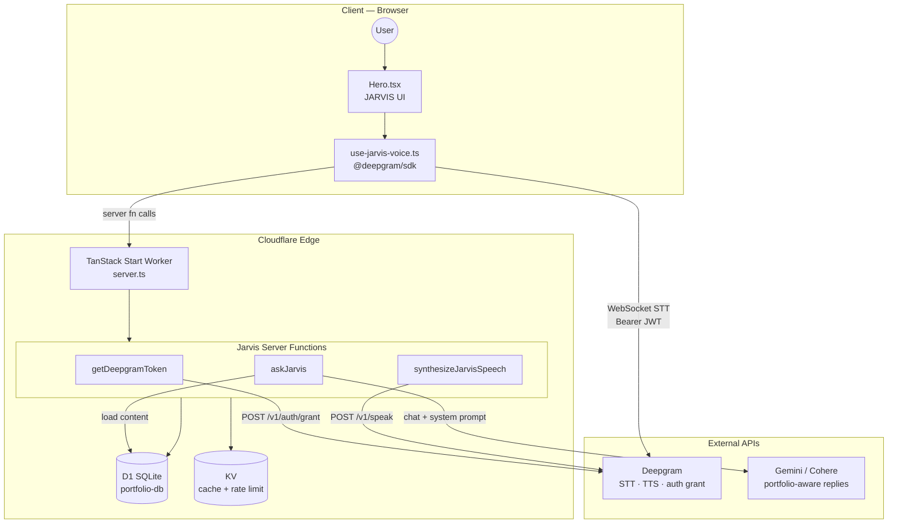
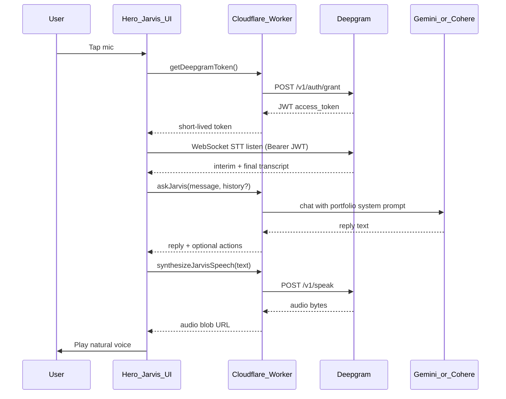

# My Intelligent Portfolio

A full-stack personal portfolio with an admin dashboard for editing content, contact form handling, and Cloudflare-native deployment.

The main application lives in `Anurag313y/`. The repo root forwards scripts to that folder.

---

## Tech Stack

### Architecture at a Glance

| Layer | Choice |
|---|---|
| **Language** | TypeScript (strict, ES2022) |
| **Full-stack framework** | TanStack Start |
| **Hosting / runtime** | Cloudflare Workers |
| **Build tool** | Vite 7 |
| **Database** | Cloudflare D1 (SQLite) |
| **ORM** | Drizzle ORM |

This is a **full-stack SSR React app** deployed as a single Cloudflare Worker — not a separate frontend + backend.

---

### Core Framework & Routing

**TanStack Start** powers the app end-to-end:

- Server-side rendering (SSR)
- Server functions via `createServerFn` (typed RPC-style API)
- Entry point: `src/server.ts` → TanStack Start server handler on Workers

**TanStack Router** handles routing with file-based routes:

- `/` — public portfolio
- `/admin` — admin dashboard
- `/reset-password` — password reset

**TanStack React Query** manages client-side data:

- Portfolio content is loaded in route loaders and cached (5-minute stale time)
- Integrated into the router context

---

### Frontend (UI)

| Category | Stack |
|---|---|
| **UI library** | React 19 |
| **Styling** | Tailwind CSS v4 (`@tailwindcss/vite`) |
| **Design system** | shadcn/ui — **New York** style, Slate base, CSS variables |
| **Primitives** | Radix UI (dialog, tabs, select, accordion, etc.) |
| **Icons** | Lucide React |
| **Animations** | Framer Motion (Hero, NavBar, sections) |
| **Forms** | React Hook Form + Zod validators |
| **Toasts** | Sonner |
| **Charts** | Recharts (via shadcn `chart` component) |
| **Utilities** | `clsx`, `tailwind-merge`, `class-variance-authority` |

Tailwind v4 uses a custom theme in `styles.css` with **OKLCH colors** and dark mode via a `.dark` class.

Other UI pieces: **cmdk** (command palette), **vaul** (drawer), **embla-carousel**, **react-day-picker**, **input-otp**.

---

### Backend & Cloudflare Services

Configured in `wrangler.jsonc`:

| Service | Purpose |
|---|---|
| **Cloudflare Workers** | Runs the SSR app (`nodejs_compat` enabled) |
| **Cloudflare D1** | SQLite database (`portfolio-db`) |
| **Cloudflare KV** | Portfolio content cache (`PORTFOLIO_CACHE`, 5-min TTL) |
| **Wrangler** | Local dev, deploy, D1 migrations, type generation |

**Drizzle ORM** maps to D1 with SQLite dialect. Tables:

- `portfolio_content` — editable portfolio JSON
- `admin_users` — admin accounts
- `sessions` — session tokens
- `contact_messages` — contact form submissions

Migrations live in `drizzle/migrations/` and are applied with `wrangler d1 migrations apply`.

---

### Auth & Security

Custom auth (no NextAuth/Clerk/etc.):

- **Password hashing**: Web Crypto PBKDF2 (100k iterations, SHA-256)
- **Sessions**: DB-backed sessions + HTTP-only cookie (`portfolio_session`, 7-day expiry)
- **Secrets**: `ADMIN_EMAIL`, `ADMIN_PASSWORD`, and `DEEPGRAM_API_KEY` from `.dev.vars` (local) or `wrangler secret put` (production)

---

### Data Flow Pattern

```
Browser → TanStack Router loader / React Query
       → createServerFn (portfolio.functions.ts, auth.functions.ts, contact.functions.ts)
       → content.server.ts
       → D1 (via Drizzle) + KV cache
```

Portfolio content is:

1. Read from KV cache when possible
2. Fallback to D1
3. Merged with defaults from `portfolio-defaults.ts`
4. API keys (Gemini/Cohere) are stripped before sending public content

---

### Validation & Types

- **Zod** validates server function inputs (admin login, contact form, content updates)
- Shared types in `content.types.ts`
- Path alias `@/*` → `src/*`

---

### Developer Tooling

| Tool | Role |
|---|---|
| **Vite 7** | Dev server (port 5173), build |
| **@cloudflare/vite-plugin** | Workers SSR integration |
| **ESLint 9** | Linting (React Hooks, Prettier integration) |
| **Prettier** | Formatting |
| **drizzle-kit** | Schema migrations against D1 |
| **TypeScript 5.8** | Strict type checking |

---

### App Features

- **Dynamic portfolio** — content editable from `/admin`, stored in D1
- **Contact form** — validated server-side, saved to D1
- **Interactive terminal section** — client-side command simulation (static, not AI-powered today)
- **JARVIS voice assistant** — Deepgram STT + TTS (natural voice), portfolio-aware replies via Gemini/Cohere or static fallback
- **AI config hooks** — admin can store Gemini/Cohere API keys and choose a primary model; keys are admin-only and not exposed publicly
- **Resume** — static PDF served from the client build

---

### Deployment

```bash
npm run build   # Vite build
npm run deploy  # build + wrangler deploy (from Anurag313y/)
```

The Worker is named `anurag-portfolio` with observability enabled.

---

### Summary

**A TypeScript full-stack portfolio built with TanStack Start + React 19, styled with Tailwind v4 and shadcn/ui, backed by Cloudflare Workers, D1, and KV, with Drizzle ORM and custom session auth — deployed via Wrangler.**

---

## Getting Started

```bash
# Install dependencies
cd Anurag313y
npm install

# Copy env vars for local dev
cp .dev.vars.example .dev.vars
# Edit .dev.vars with admin credentials and DEEPGRAM_API_KEY (see Anurag313y/.dev.vars.example)

# Apply local D1 migrations
npm run db:migrate:local

# Start dev server
npm run dev
```

From the repo root:

```bash
npm run dev
npm run build
npm run db:migrate:local
```

---

## JARVIS Voice with Deepgram (STT + TTS)

**Overview:** Replace browser Web Speech with Deepgram STT + TTS (natural voice), proxy API keys through Cloudflare Workers, and serve Jarvis chat from the server using Gemini/Cohere admin config for portfolio-grounded replies.

---

### Target Architecture

#### System Overview



| Layer | Components | Role |
|-------|------------|------|
| **Client** | `Hero.tsx`, `use-jarvis-voice.ts` | Mic capture, live transcript UI, audio playback |
| **Worker** | `jarvis.functions.ts`, `jarvis.server.ts`, `deepgram.server.ts`, `llm.server.ts` | Proxy secrets, LLM routing, rate limits |
| **Cloudflare data** | D1, KV | Portfolio content, sessions, cache, per-IP limits |
| **External** | Deepgram, Gemini/Cohere | Speech ↔ text, natural language answers |

#### Voice Request Flow



**Why two paths to Deepgram?**

| Concern | Approach |
|--------|----------|
| **STT latency** | Live WebSocket from the **browser** using a **temporary JWT** from your Worker ([Deepgram token auth](https://developers.deepgram.com/guides/fundamentals/token-based-authentication)) — never ship the main API key to the client |
| **TTS** | **Server-proxied** `POST /v1/speak` is simpler and keeps billing/control on the Worker; optional later: client streaming TTS with another short-lived token |

---

### Current State (Hero UI)

JARVIS in `Anurag313y/src/components/portfolio/Hero.tsx` uses:

- UI states: `ready` → `listening` → `processing` → `responding`
- **STT**: Deepgram live WebSocket via `@deepgram/sdk` + short-lived JWT from Worker
- **TTS**: Server-proxied Deepgram Aura voice (`synthesizeJarvisSpeech`)
- **Brain**: Server-side `askJarvis` → Gemini / Cohere / static fallback

Admin stores **Gemini** and **Cohere** keys + `primaryModel` in D1 (`AdminDashboard.tsx` API panel), stripped from public responses in `toPublicContent()`. Deepgram key stays in Wrangler secrets only.

---

### APIs You Need (signup + keys)

#### 1. Deepgram (required)

| Purpose | Endpoint | Auth |
|--------|----------|------|
| **Grant temp token** (for browser STT) | `POST https://api.deepgram.com/v1/auth/grant` | `Authorization: Token <DEEPGRAM_API_KEY>` |
| **Live STT** (browser) | `wss://api.deepgram.com/v1/listen?model=nova-3&...` | `Authorization: Bearer <JWT>` at connect |
| **TTS** (server) | `POST https://api.deepgram.com/v1/speak?model=aura-2-thalia-en&encoding=mp3` | `Authorization: Token <DEEPGRAM_API_KEY>` |
| **Body (TTS)** | `{ "text": "..." }` | Returns MP3 (or WAV) stream |

**From [Deepgram Console](https://console.deepgram.com/):**

- One **API key** with permissions for listen + speak + auth grant
- Suggested models:
  - STT: `nova-3` (or `nova-2` per your plan)
  - TTS: `aura-2-thalia-en` (natural English; swap in admin later if desired)

**Client package:** `@deepgram/sdk` for live microphone → WebSocket (works with access token factory).

**Billing note:** Deepgram charges per audio minute (STT) and per character (TTS). Rate limiting is enforced on the Worker (see below).

#### 2. Conversational Brain (recommended — already in app)

Deepgram does **not** answer questions about your portfolio; it only converts speech ↔ text. You still need an LLM:

| Provider | API | When to use |
|----------|-----|-------------|
| **Google Gemini** | `POST https://generativelanguage.googleapis.com/v1beta/models/gemini-2.0-flash:generateContent?key=...` | Admin `primaryModel: gemini` |
| **Cohere** | `POST https://api.cohere.com/v2/chat` | Admin `primaryModel: cohere` |
| **Static fallback** | Server-side regex / keyword logic | `primaryModel: static` or missing keys |

**You need:** at least one of Gemini API key or Cohere API key (editable in admin). Get Gemini from [Google AI Studio](https://aistudio.google.com/apikey).

#### 3. Browser APIs (no keys)

- `navigator.mediaDevices.getUserMedia({ audio: true })` — mic permission
- `HTMLAudioElement` / `AudioContext` — play Deepgram MP3 response

Optional fallback to static text-only suggestions if mic or Deepgram fails.

---

### Secrets & Configuration

#### Production (Cloudflare)

```bash
cd Anurag313y
wrangler secret put DEEPGRAM_API_KEY
# existing:
wrangler secret put ADMIN_EMAIL
wrangler secret put ADMIN_PASSWORD
```

#### Local (`Anurag313y/.dev.vars.example`)

```env
DEEPGRAM_API_KEY="your-deepgram-key"
ADMIN_EMAIL="..."
ADMIN_PASSWORD="..."
```

#### Admin UI (API panel)

Stored in D1, **never** in public content:

- `deepgramApiKey` (optional override) — **recommended:** use Worker secret only, not D1
- `deepgramSttModel`, `deepgramTtsModel`, `deepgramTtsVoice` (optional tuning)
- `jarvisEnabled: boolean` (kill switch)

**Recommendation:** store **only** `DEEPGRAM_API_KEY` in Wrangler secrets (like admin password), not in portfolio JSON — reduces leak surface if admin DB is ever exported.

---

### Server Implementation

| File | Responsibility |
|------|----------------|
| `Anurag313y/src/lib/api/jarvis.functions.ts` | `createServerFn` endpoints |
| `Anurag313y/src/lib/jarvis.server.ts` | Deepgram token grant, TTS proxy, LLM routing |
| `Anurag313y/src/lib/deepgram.server.ts` | Thin fetch wrappers for grant + speak |
| `Anurag313y/src/lib/llm.server.ts` | Gemini + Cohere adapters + system prompt builder |
| `Anurag313y/src/lib/jarvis-answer.server.ts` | Static fallback answers |
| `Anurag313y/src/lib/jarvis-actions.ts` | Structured scroll / resume actions |

#### Server functions (public, rate-limited)

1. **`getDeepgramToken`** — `POST /v1/auth/grant` → `{ accessToken, expiresIn }`
2. **`askJarvis`** — input: `{ message: string, history?: { role, content }[] }` (cap history ~6 turns)
   - Load admin content server-side (`fetchAdminContent()`)
   - Build system prompt from `profile`, `projects`, `skills`, `experience`, `about`
   - Call Gemini or Cohere per `primaryModel`; fallback to static logic server-side
   - Return `{ text, actions?: { scrollTo?: string } }` (actions as structured data, not DOM on server)
3. **`synthesizeJarvisSpeech`** — input: `{ text: string }` → returns `audio/mpeg` bytes or base64 + mime

#### Rate limiting (important)

Uses **Cloudflare KV** (`PORTFOLIO_CACHE` or a dedicated `JARVIS_RATE` namespace):

- Max **30** `askJarvis` + **60** TTS requests per IP per hour
- Returns `429` with a friendly message when exceeded

---

### Client Implementation

Hook: `Anurag313y/src/hooks/use-jarvis-voice.ts`

| Step | Behavior |
|------|----------|
| Start listen | Request mic → `getDeepgramToken()` → open Deepgram live connection → show interim transcript |
| Stop / finalize | Close WS, send final transcript to `askJarvis` |
| Respond | Set `responding`, play audio from `synthesizeJarvisSpeech` via `URL.createObjectURL` |
| Actions | Map server `scrollTo` ids (`projects`, `skills`, etc.) to `scrollIntoView` / `window.open` for resume |
| Errors | Toast + revert to `ready`; re-fetch token if expired |

`Hero.tsx`:

- Uses `use-jarvis-voice` hook (no Web Speech primary path)
- `supported` → `micSupported && deepgramConfigured`
- Suggestion chips still call text-only `handleQuery(text)`

### System Prompt (Jarvis Personality)

Keep answers **short for voice** (1–3 sentences unless user asks for detail), first-person as assistant (“Anurag’s top project is…”), only use portfolio data from context, refuse unrelated requests politely, suggest contact/projects when unsure.

### Dependencies

```bash
cd Anurag313y
npm install @deepgram/sdk
```

Use SDK on **client** for live STT only; server uses `fetch` for grant + speak to avoid bundling issues on Workers.

---

### Phased Delivery

| Phase | Deliverable | Status |
|-------|-------------|--------|
| **1** | Worker secrets + `getDeepgramToken` + live STT in Hero | Done |
| **2** | `synthesizeJarvisSpeech` + replace `speechSynthesis` | Done |
| **3** | `askJarvis` + Gemini/Cohere + structured scroll actions | Done |
| **4** | KV rate limits + admin kill switch + error/fallback UX | Done |

### Testing Checklist

1. Local: set `DEEPGRAM_API_KEY` in `.dev.vars`, run `npm run dev`
2. Chrome/Edge: mic permission → speak → see live transcript → hear Aura voice reply
3. Admin: set `primaryModel` to `gemini`, save key, ask open-ended question (not just keywords)
4. Verify public `getPortfolioContent` response has **no** Deepgram/Gemini/Cohere keys
5. Deploy: `wrangler secret put DEEPGRAM_API_KEY` then smoke test production URL

### Summary: APIs to Obtain

| Service | What you get | Used for |
|---------|----------------|----------|
| **Deepgram** | API key | STT (live), TTS (speak), temp tokens |
| **Google Gemini** *or* **Cohere** | API key (admin UI) | Natural language answers about portfolio |
| **Browser** | Mic permission | Capture audio — no key |

No OpenAI/ElevenLabs required for this stack.
